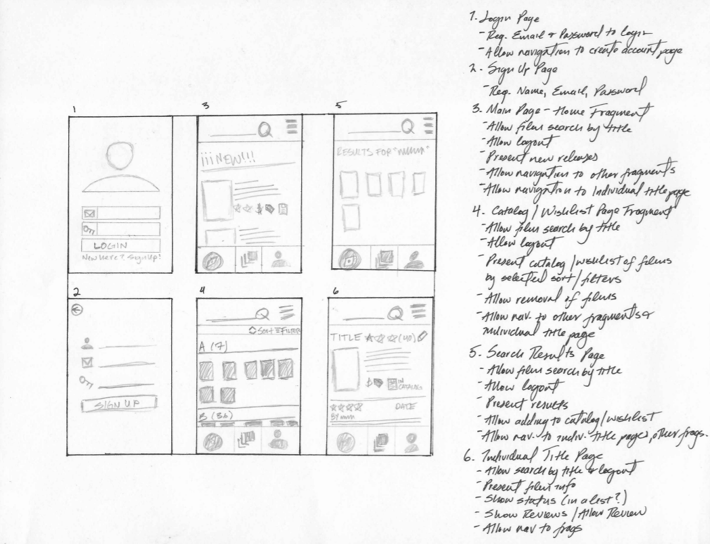
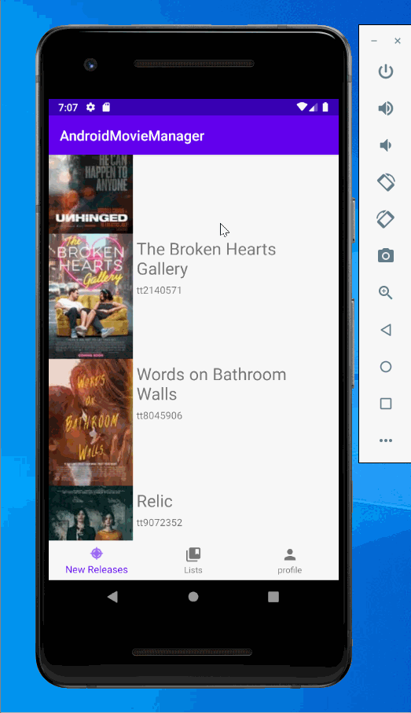

# Android Movie Manager

## Table of Contents
1. [Overview](#Overview)
1. [Product Spec](#Product-Spec)
1. [Wireframes](#Wireframes)
2. [Schema](#Schema)

## Overview
### Description
The Movie Manager allows a movie to organize their movie collection and determine which movies to add to their collection based on other users reviews.

### App Evaluation
[Evaluation of your app across the following attributes]
- **Category:** Android Application, Organizer, Cataloger
- **Mobile:** Yes
- **Story:** None
- **Market:** Niche
- **Habit:** If you have a growing film collection, this might be a tool you frequent
- **Scope:** Who knows

## Product Spec

### 1. User Stories (Required and Optional)

**Required Must-have Stories**

* User sign up/sign in/sign out
* Present current DVD releases
* Search for a film, by title, present movie details and user reviews
* Add a film to a catalog
* View catalog, allow for sorting
* Add a film to a wishlist
* View wishlist, allow for sorting
* Review a film

**Optional Nice-to-have Stories**

* Get prices for DVDs from several retailers for price comparison
* Search for a film by genre/year/rating
* Send email notifications of new releases, catalog updates


### 2. Screen Archetypes

* Sign In Screen - See Wireframe Screen #1
* Sign Up Screen - See Wireframe Screen #2
* Main Screen (New Releases Fragment) - See Wireframe Screen #3
* Main Screen (Catalog/Wish List Screen) - See Wireframe Screen #4
* Search Results Screen - See Wireframe Screen #5
* Individual Film Screen - See Wireframe Screen #6
* User Profile Screen
  * As a user I would like to see my profile information and update it if need by
  * As a user I would like to see my most recent additions to my catalog and wishlist
  * As a user I would like to see an overview report of my lists (# of films in catalog/wishlist, # of reviews written)
  * As a user I would like to see a list of reviews I have written

### 3. Navigation

**Tab Navigation** (Tab to Screen)

* [fill out your first tab]
* [fill out your second tab]
* [fill out your third tab]

**Flow Navigation** (Screen to Screen)

* [list first screen here]
   * [list screen navigation here]
   * ...
* [list second screen here]
   * [list screen navigation here]
   * ...

## Wireframes
[Add picture of your hand sketched wireframes in this section]


## Schema 
### Models

#### Users

   | Property      | Type     | Description |
   | ------------- | -------- | ------------|
   | objectId      | String   | unique id for the user (default field) |
   | name          | String   | user name   |
   | password      | String   | user name   |
   | email         | Email    | user email  |
   | createdAt     | DateTime | date when user is created (default field) |
   
#### Movie

   | Property      | Type     | Description |
   | ------------- | -------- | ------------|
   | objectId      | String   | unique id for the movie (default field) |
   | title         | String   | movie name   |
   | year          | String   | movie year   |
   | description   | String   | movie description   |
   | poster        | File     | movie poster   |

#### Review

   | Property      | Type     | Description |
   | ------------- | -------- | ------------|
   | objectId      | String   | unique id for the review (default field) |
   | user id       | String   | user id   |
   | movie id      | String   | movie id   |
   | review        | String   | user review of movie   |
   
#### Catalog

   | Property      | Type     | Description |
   | ------------- | -------- | ------------|
   | objectId      | String   | unique id for the review (default field) |
   | user id       | String   | user id   |
   | movie id      | String   | movie id   |
   
#### Wish List

   | Property      | Type     | Description |
   | ------------- | -------- | ------------|
   | objectId      | String   | unique id for the review (default field) |
   | user id       | String   | user id   |
   | movie id      | String   | movie id   |
   
### Networking
#### List of network requests by screen
   - Home Feed Screen
      - (Read/GET) Query all posts where user is author
         ```swift
         let query = PFQuery(className:"Post")
         query.whereKey("author", equalTo: currentUser)
         query.order(byDescending: "createdAt")
         query.findObjectsInBackground { (posts: [PFObject]?, error: Error?) in
            if let error = error { 
               print(error.localizedDescription)
            } else if let posts = posts {
               print("Successfully retrieved \(posts.count) posts.")
           // TODO: Do something with posts...
            }
         }
         ```
      - (Create/POST) Create a new like on a post
      - (Delete) Delete existing like
      - (Create/POST) Create a new comment on a post
      - (Delete) Delete existing comment
   - Create Post Screen
      - (Create/POST) Create a new post object
   - Profile Screen
      - (Read/GET) Query logged in user object
      - (Update/PUT) Update user profile image

### [BONUS] Digital Wireframes & Mockups

### [BONUS] Interactive Prototype

## Schema 
[This section will be completed in Unit 9]
### Models
[Add table of models]
### Networking
- [Add list of network requests by screen ]
- [Create basic snippets for each Parse network request]
- [OPTIONAL: List endpoints if using existing API such as Yelp]

## Video Walkthrough

Here's a walkthrough of implemented user stories:



GIF created with [LiceCap](http://www.cockos.com/licecap/).

